# DNF AutoFire 流程文档

## 概述

本文档描述 DNF AutoFire 的核心业务流程，使用 Mermaid 流程图进行可视化说明。

---

## 1. 系统启动流程

### 1.1 应用启动序列图

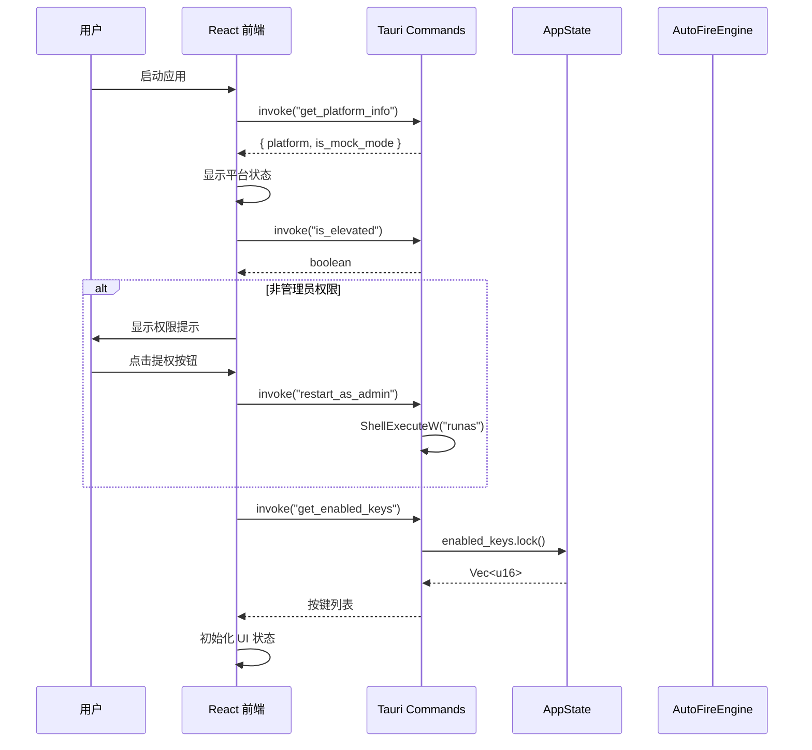
```mermaid
sequenceDiagram
    participant User as 用户
    participant React as React 前端
    participant Tauri as Tauri Commands
    participant State as AppState
    participant Engine as AutoFireEngine

    User->>React: 启动应用
    React->>Tauri: invoke("get_platform_info")
    Tauri-->>React: { platform, is_mock_mode }
    React->>React: 显示平台状态

    React->>Tauri: invoke("is_elevated")
    Tauri-->>React: boolean

    alt 非管理员权限
        React->>User: 显示权限提示
        User->>React: 点击提权按钮
        React->>Tauri: invoke("restart_as_admin")
        Tauri->>Tauri: ShellExecuteW("runas")
    end

    React->>Tauri: invoke("get_enabled_keys")
    Tauri->>State: enabled_keys.lock()
    State-->>Tauri: Vec<u16>
    Tauri-->>React: 按键列表
    React->>React: 初始化 UI 状态
```

### 1.2 应用初始化流程图

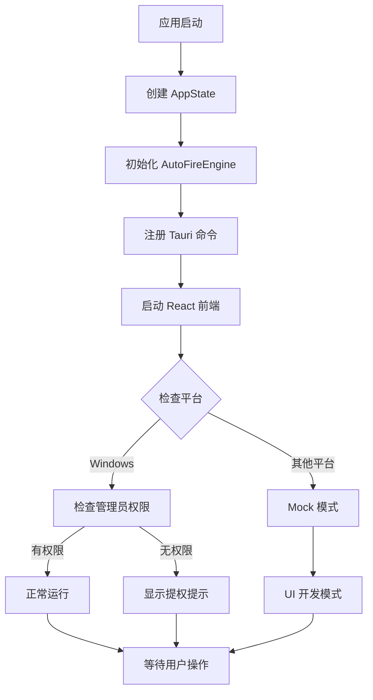
```mermaid
flowchart TD
    A[应用启动] --> B[创建 AppState]
    B --> C[初始化 AutoFireEngine]
    C --> D[注册 Tauri 命令]
    D --> E[启动 React 前端]
    E --> F{检查平台}

    F -->|Windows| G[检查管理员权限]
    F -->|其他平台| H[Mock 模式]

    G -->|有权限| I[正常运行]
    G -->|无权限| J[显示提权提示]

    H --> K[UI 开发模式]
    I --> L[等待用户操作]
    J --> L
    K --> L
```

---

## 2. 按键配置流程

### 2.1 切换按键状态序列图

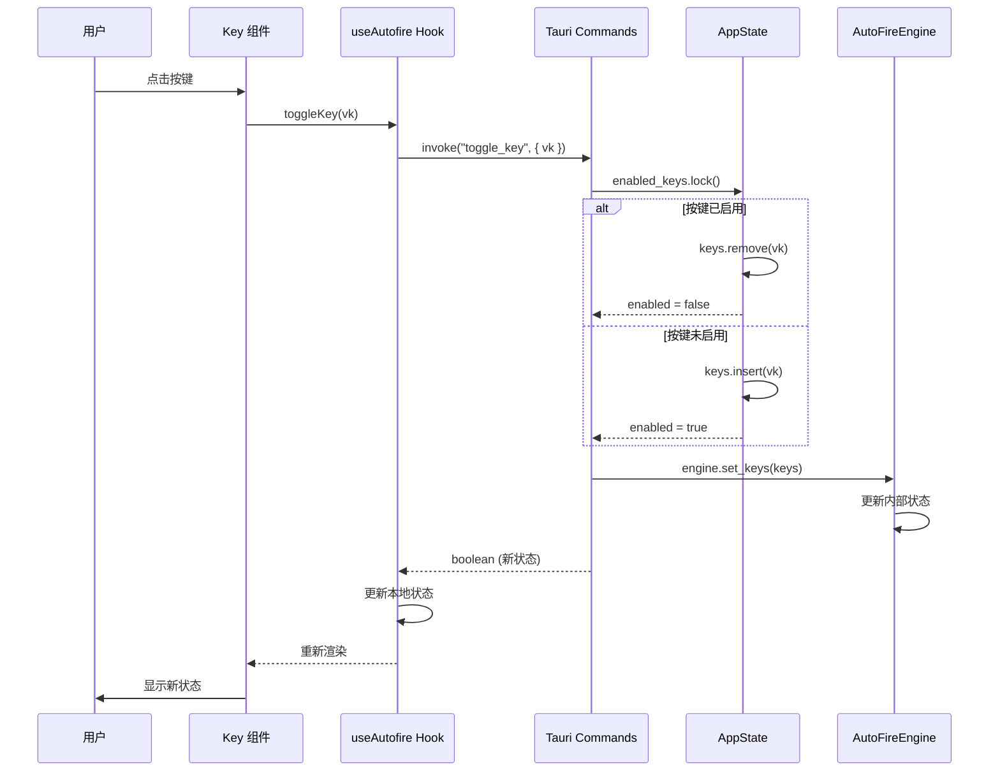
```mermaid
sequenceDiagram
    participant User as 用户
    participant Key as Key 组件
    participant Hook as useAutofire Hook
    participant Tauri as Tauri Commands
    participant State as AppState
    participant Engine as AutoFireEngine

    User->>Key: 点击按键
    Key->>Hook: toggleKey(vk)
    Hook->>Tauri: invoke("toggle_key", { vk })

    Tauri->>State: enabled_keys.lock()

    alt 按键已启用
        State->>State: keys.remove(vk)
        State-->>Tauri: enabled = false
    else 按键未启用
        State->>State: keys.insert(vk)
        State-->>Tauri: enabled = true
    end

    Tauri->>Engine: engine.set_keys(keys)
    Engine->>Engine: 更新内部状态

    Tauri-->>Hook: boolean (新状态)
    Hook->>Hook: 更新本地状态
    Hook-->>Key: 重新渲染
    Key->>User: 显示新状态
```

### 2.2 按键状态切换流程图

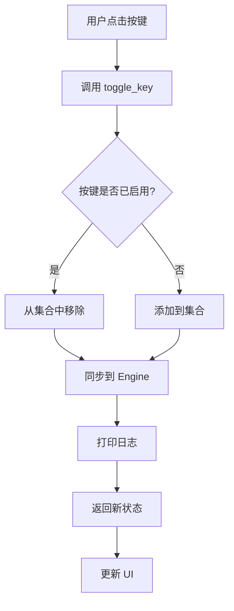
```mermaid
flowchart TD
    A[用户点击按键] --> B[调用 toggle_key]
    B --> C{按键是否已启用?}

    C -->|是| D[从集合中移除]
    C -->|否| E[添加到集合]

    D --> F[同步到 Engine]
    E --> F

    F --> G[打印日志]
    G --> H[返回新状态]
    H --> I[更新 UI]
```

---

## 3. 连发控制流程

### 3.1 启动连发序列图

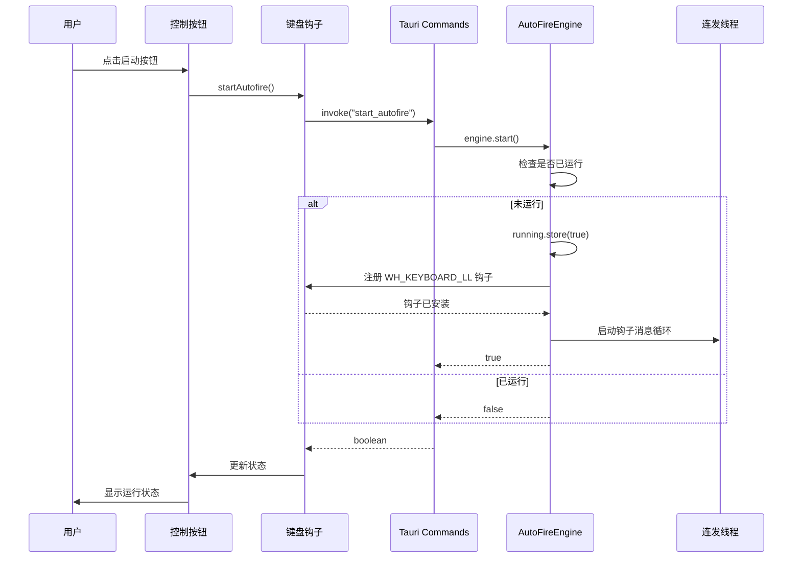
```mermaid
sequenceDiagram
    participant User as 用户
    participant UI as 控制按钮
    participant Hook as useAutofire Hook
    participant Tauri as Tauri Commands
    participant Engine as AutoFireEngine
    participant Hook as 键盘钩子
    participant Thread as 连发线程

    User->>UI: 点击启动按钮
    UI->>Hook: startAutofire()
    Hook->>Tauri: invoke("start_autofire")

    Tauri->>Engine: engine.start()

    Engine->>Engine: 检查是否已运行

    alt 未运行
        Engine->>Engine: running.store(true)
        Engine->>Hook: 注册 WH_KEYBOARD_LL 钩子
        Hook-->>Engine: 钩子已安装
        Engine->>Thread: 启动钩子消息循环
        Engine-->>Tauri: true
    else 已运行
        Engine-->>Tauri: false
    end

    Tauri-->>Hook: boolean
    Hook->>UI: 更新状态
    UI->>User: 显示运行状态
```

### 3.2 停止连发序列图

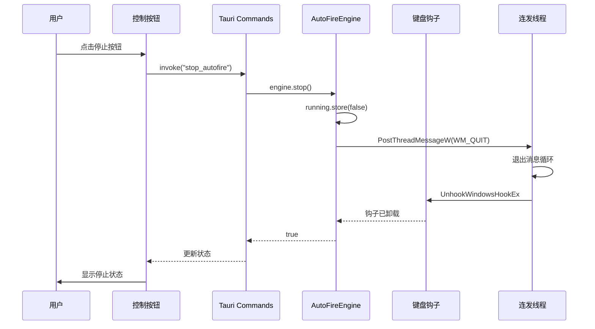
```mermaid
sequenceDiagram
    participant User as 用户
    participant UI as 控制按钮
    participant Tauri as Tauri Commands
    participant Engine as AutoFireEngine
    participant Hook as 键盘钩子
    participant Thread as 连发线程

    User->>UI: 点击停止按钮
    UI->>Tauri: invoke("stop_autofire")

    Tauri->>Engine: engine.stop()
    Engine->>Engine: running.store(false)
    Engine->>Thread: PostThreadMessageW(WM_QUIT)
    Thread->>Thread: 退出消息循环
    Thread->>Hook: UnhookWindowsHookEx
    Hook-->>Engine: 钩子已卸载

    Engine-->>Tauri: true
    Tauri-->>UI: 更新状态
    UI->>User: 显示停止状态
```

### 3.3 连发控制流程图

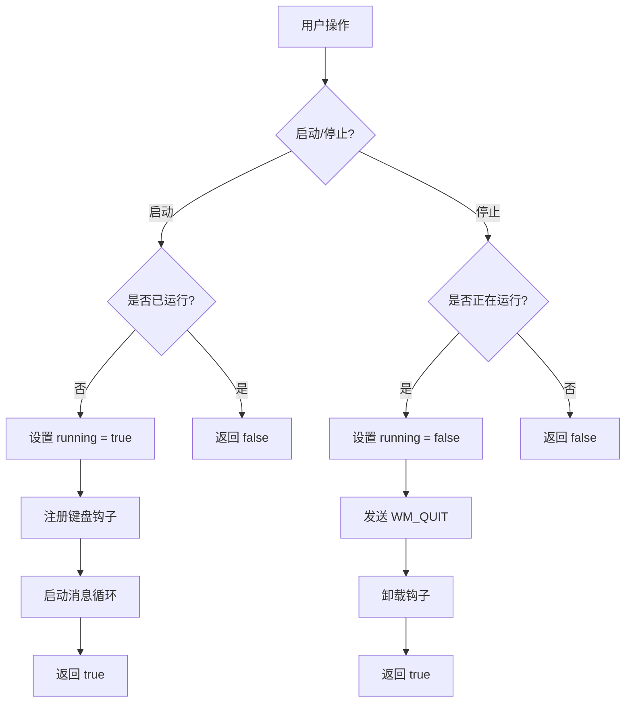
```mermaid
flowchart TD
    A[用户操作] --> B{启动/停止?}

    B -->|启动| C{是否已运行?}
    B -->|停止| D{是否正在运行?}

    C -->|否| E[设置 running = true]
    C -->|是| F[返回 false]

    E --> G[注册键盘钩子]
    G --> H[启动消息循环]
    H --> I[返回 true]

    D -->|是| J[设置 running = false]
    D -->|否| K[返回 false]

    J --> L[发送 WM_QUIT]
    L --> M[卸载钩子]
    M --> N[返回 true]
```

---

## 4. 连发执行流程

### 4.1 按键连发核心流程

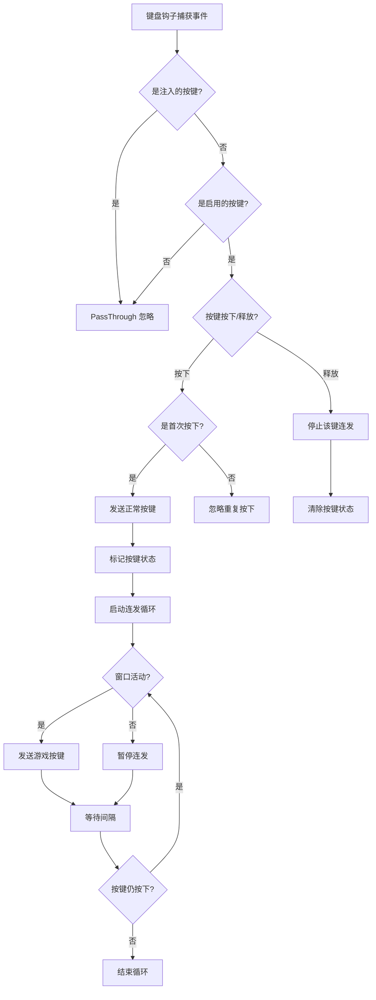
```mermaid
flowchart TD
    A[键盘钩子捕获事件] --> B{是注入的按键?}

    B -->|是| C[PassThrough 忽略]
    B -->|否| D{是启用的按键?}

    D -->|否| C
    D -->|是| E{按键按下/释放?}

    E -->|按下| F{是首次按下?}
    E -->|释放| G[停止该键连发]

    F -->|是| H[发送正常按键]
    F -->|否| I[忽略重复按下]

    H --> J[标记按键状态]
    J --> K[启动连发循环]

    G --> L[清除按键状态]

    K --> M{窗口活动?}
    M -->|是| N[发送游戏按键]
    M -->|否| O[暂停连发]

    N --> P[等待间隔]
    O --> P

    P --> Q{按键仍按下?}
    Q -->|是| M
    Q -->|否| R[结束循环]
```

### 4.2 连发循环时序图

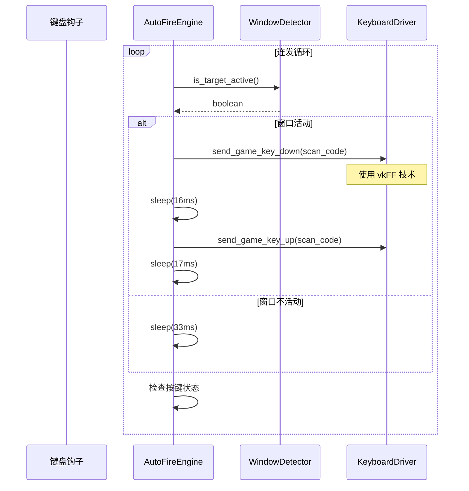
```mermaid
sequenceDiagram
    participant Hook as 键盘钩子
    participant Engine as AutoFireEngine
    participant Window as WindowDetector
    participant Keyboard as KeyboardDriver

    loop 连发循环
        Engine->>Window: is_target_active()
        Window-->>Engine: boolean

        alt 窗口活动
            Engine->>Keyboard: send_game_key_down(scan_code)
            Note over Keyboard: 使用 vkFF 技术
            Engine->>Engine: sleep(16ms)
            Engine->>Keyboard: send_game_key_up(scan_code)
            Engine->>Engine: sleep(17ms)
        else 窗口不活动
            Engine->>Engine: sleep(33ms)
        end

        Engine->>Engine: 检查按键状态
    end
```

---

## 5. 动作执行流程

### 5.1 ActionExecutor 执行流程

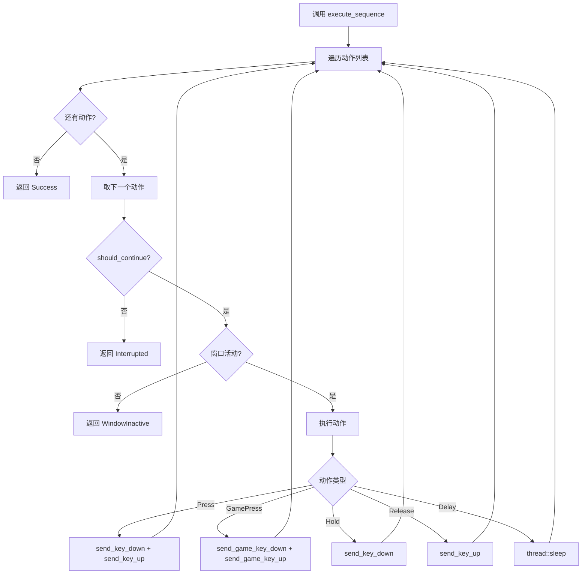
```mermaid
flowchart TD
    A[调用 execute_sequence] --> B[遍历动作列表]

    B --> C{还有动作?}
    C -->|否| D[返回 Success]
    C -->|是| E[取下一个动作]

    E --> F{should_continue?}
    F -->|否| G[返回 Interrupted]
    F -->|是| H{窗口活动?}

    H -->|否| I[返回 WindowInactive]
    H -->|是| J[执行动作]

    J --> K{动作类型}

    K -->|Press| L[send_key_down + send_key_up]
    K -->|GamePress| M[send_game_key_down + send_game_key_up]
    K -->|Hold| N[send_key_down]
    K -->|Release| O[send_key_up]
    K -->|Delay| P[thread::sleep]

    L --> B
    M --> B
    N --> B
    O --> B
    P --> B
```

### 5.2 规则循环执行流程

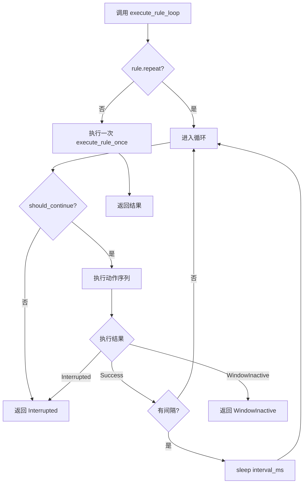
```mermaid
flowchart TD
    A[调用 execute_rule_loop] --> B{rule.repeat?}

    B -->|否| C[执行一次 execute_rule_once]
    B -->|是| D[进入循环]

    D --> E{should_continue?}
    E -->|否| F[返回 Interrupted]
    E -->|是| G[执行动作序列]

    G --> H{执行结果}

    H -->|Success| I{有间隔?}
    H -->|Interrupted| F
    H -->|WindowInactive| J[返回 WindowInactive]

    I -->|是| K[sleep interval_ms]
    I -->|否| D

    K --> D

    C --> L[返回结果]
```

---

## 6. Profile 管理流程

### 6.1 配置切换流程

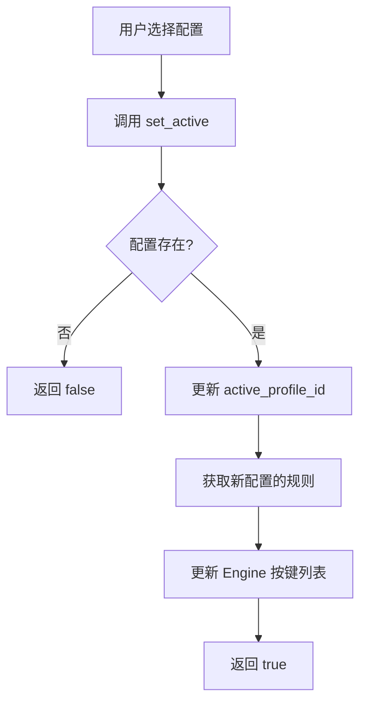
```mermaid
flowchart TD
    A[用户选择配置] --> B[调用 set_active]
    B --> C{配置存在?}

    C -->|否| D[返回 false]
    C -->|是| E[更新 active_profile_id]

    E --> F[获取新配置的规则]
    F --> G[更新 Engine 按键列表]
    G --> H[返回 true]
```

### 6.2 配置管理序列图

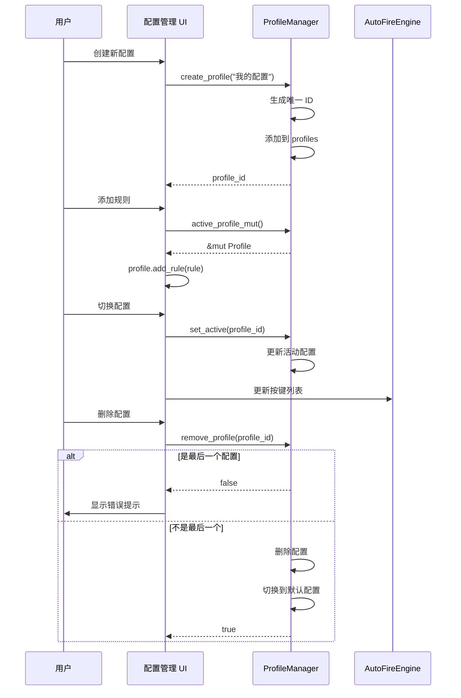
```mermaid
sequenceDiagram
    participant User as 用户
    participant UI as 配置管理 UI
    participant Manager as ProfileManager
    participant Engine as AutoFireEngine

    User->>UI: 创建新配置
    UI->>Manager: create_profile("我的配置")
    Manager->>Manager: 生成唯一 ID
    Manager->>Manager: 添加到 profiles
    Manager-->>UI: profile_id

    User->>UI: 添加规则
    UI->>Manager: active_profile_mut()
    Manager-->>UI: &mut Profile
    UI->>UI: profile.add_rule(rule)

    User->>UI: 切换配置
    UI->>Manager: set_active(profile_id)
    Manager->>Manager: 更新活动配置
    UI->>Engine: 更新按键列表

    User->>UI: 删除配置
    UI->>Manager: remove_profile(profile_id)

    alt 是最后一个配置
        Manager-->>UI: false
        UI->>User: 显示错误提示
    else 不是最后一个
        Manager->>Manager: 删除配置
        Manager->>Manager: 切换到默认配置
        Manager-->>UI: true
    end
```

---

## 7. 测试流程

### 7.1 Mock 测试流程

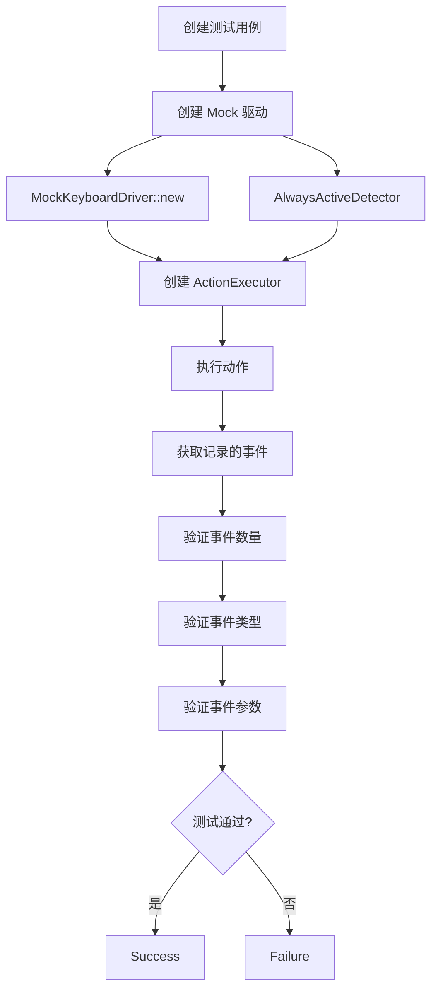
```mermaid
flowchart TD
    A[创建测试用例] --> B[创建 Mock 驱动]

    B --> C[MockKeyboardDriver::new]
    B --> D[AlwaysActiveDetector]

    C --> E[创建 ActionExecutor]
    D --> E

    E --> F[执行动作]
    F --> G[获取记录的事件]

    G --> H[验证事件数量]
    H --> I[验证事件类型]
    I --> J[验证事件参数]

    J --> K{测试通过?}
    K -->|是| L[Success]
    K -->|否| M[Failure]
```

### 7.2 跨平台测试策略

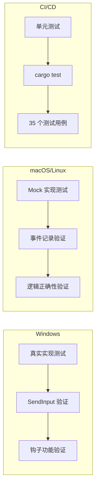
```mermaid
flowchart LR
    subgraph Windows
        A[真实实现测试] --> B[SendInput 验证]
        B --> C[钩子功能验证]
    end

    subgraph macOS/Linux
        D[Mock 实现测试] --> E[事件记录验证]
        E --> F[逻辑正确性验证]
    end

    subgraph CI/CD
        G[单元测试] --> H[cargo test]
        H --> I[35 个测试用例]
    end
```

---

## 8. 错误处理流程

### 8.1 运行时错误处理

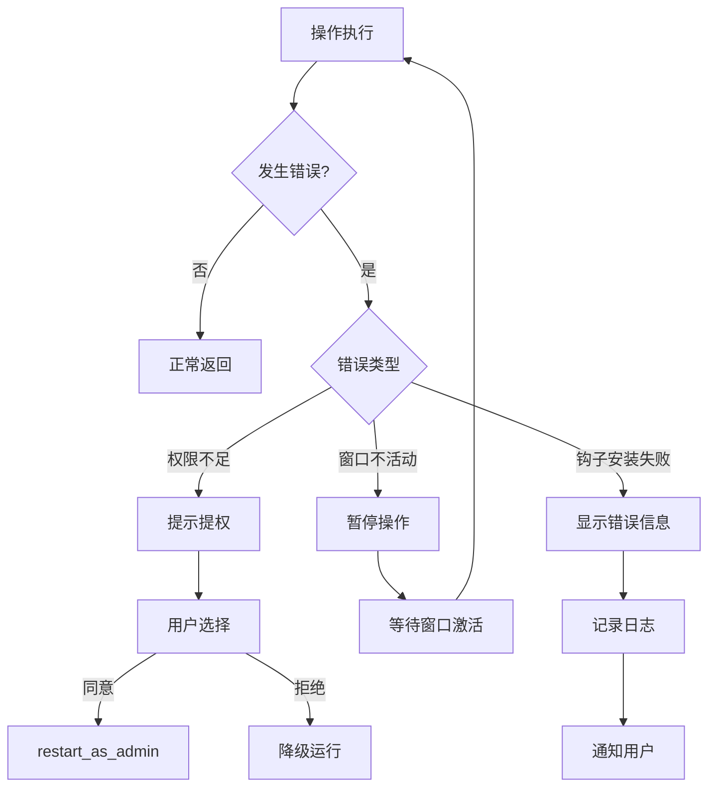
```mermaid
flowchart TD
    A[操作执行] --> B{发生错误?}

    B -->|否| C[正常返回]
    B -->|是| D{错误类型}

    D -->|权限不足| E[提示提权]
    D -->|窗口不活动| F[暂停操作]
    D -->|钩子安装失败| G[显示错误信息]

    E --> H[用户选择]
    H -->|同意| I[restart_as_admin]
    H -->|拒绝| J[降级运行]

    F --> K[等待窗口激活]
    K --> A

    G --> L[记录日志]
    L --> M[通知用户]
```

---

## 9. 状态机

### 9.1 连发引擎状态机

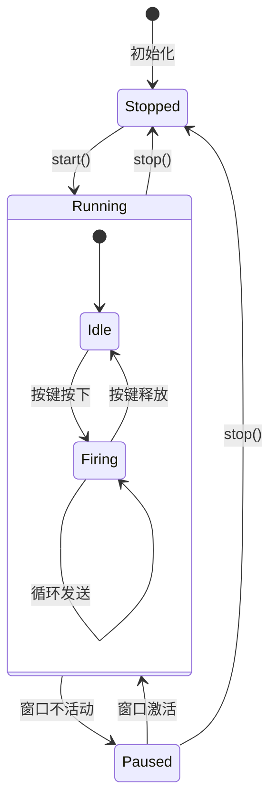
```mermaid
stateDiagram-v2
    [*] --> Stopped: 初始化

    Stopped --> Running: start()
    Running --> Stopped: stop()

    Running --> Paused: 窗口不活动
    Paused --> Running: 窗口激活
    Paused --> Stopped: stop()

    state Running {
        [*] --> Idle
        Idle --> Firing: 按键按下
        Firing --> Idle: 按键释放
        Firing --> Firing: 循环发送
    }
```

### 9.2 按键状态机

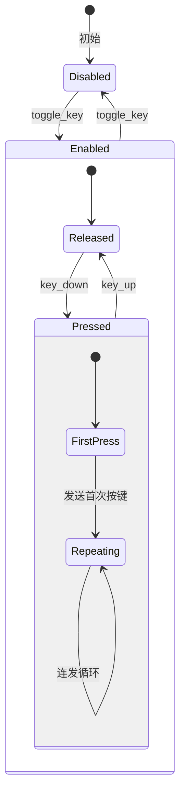
```mermaid
stateDiagram-v2
    [*] --> Disabled: 初始

    Disabled --> Enabled: toggle_key
    Enabled --> Disabled: toggle_key

    state Enabled {
        [*] --> Released
        Released --> Pressed: key_down
        Pressed --> Released: key_up

        state Pressed {
            [*] --> FirstPress
            FirstPress --> Repeating: 发送首次按键
            Repeating --> Repeating: 连发循环
        }
    }
```

---

## 10. 部署流程

### 10.1 构建发布流程

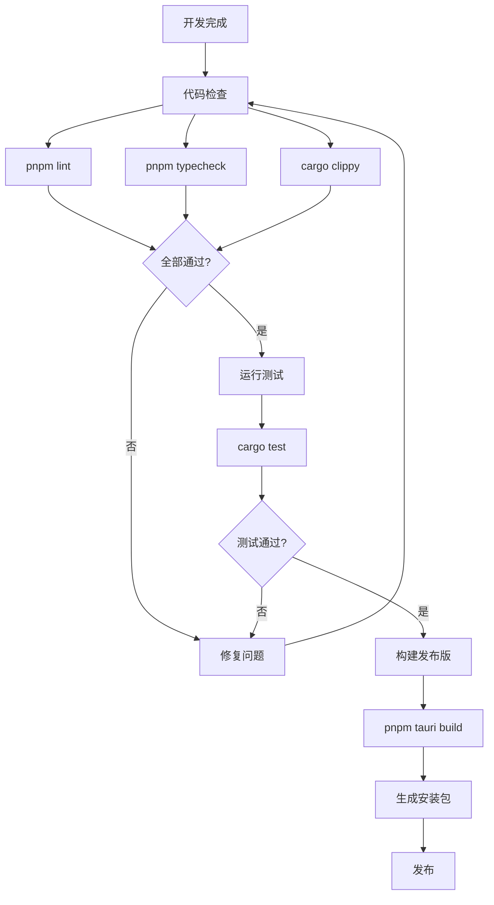
```mermaid
flowchart TD
    A[开发完成] --> B[代码检查]

    B --> C[pnpm lint]
    B --> D[pnpm typecheck]
    B --> E[cargo clippy]

    C --> F{全部通过?}
    D --> F
    E --> F

    F -->|否| G[修复问题]
    G --> B

    F -->|是| H[运行测试]
    H --> I[cargo test]

    I --> J{测试通过?}
    J -->|否| G
    J -->|是| K[构建发布版]

    K --> L[pnpm tauri build]
    L --> M[生成安装包]
    M --> N[发布]
```
